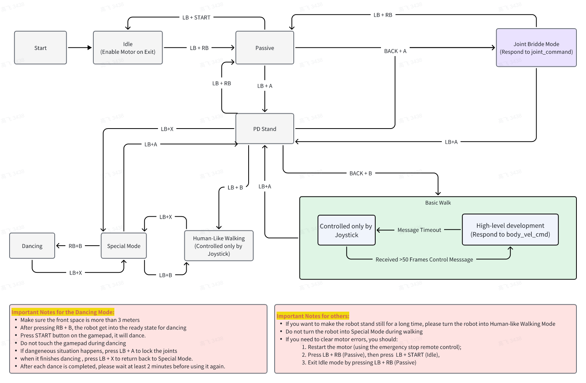

# EngineAI ROS:  Development Guide with ROS2 Interface for EngineAI Robot


## Overview

EngineAI ROS is a ROS2 package that provides a set of ROS2 nodes and tools for the EngineAI robot. It offers two types of development modes: high-level development and low-level development.

High-level development allows the user to use EngineAI's walking controller by publishing the body velocity command.

Low-level development allows the user to develop their own controller by publishing the joint command.


## ROS2 Interface Protocol
[Interface Protocol Description](src/interface_protocol/README.md)

## Architecture 

### Computing Units
The EngineAI ROS package is designed to run on both of the computing units, with the following architecture:
|Computer Name|Architecture|Description|
|---|---|---|
|Nezha|X86|High-frequency computer, responsible for motion control and data processing|
|Jetson Orin|ARM|Embedded AI computer, responsible for application functionality|

Both computing units are maintained as open platforms by EngineAI.

### Connect to the computer
| Device | IP | SSH Username | SSH Password |
| --- | --- | --- | --- |
| Nezha | 192.168.0.163 | user | 1 |
| Jetson Orin | 192.168.0.162 | ubuntu | ubuntu |

### Workspace Structure
```bash
└── src
    ├── interface_example # Interface examples, recommended to run on Nezha
    ├── interface_protocol # Interface protocols, common modules
    ├── third_party # Third-party libraries
    ├── simulation # Simulation environment running on host
```

## Build & Run

### Development Environment Requirements for Your Host PC
#### Basic Environment
- Ubuntu 22.04
- ROS2 Humble Desktop
- GCC >= 11
- CMake >= 3.22
- Python >= 3.10
#### Software Dependencies
```
sudo apt update
sudo apt install rsync sshpass openssh-client libglfw3-dev libxinerama-dev libxcursor-dev
sudo apt install ros-dev-tools ros-humble-rmw-cyclonedds-cpp ros-humble-ros-base
```

<!-- #### LCM (Lightweight Communications and Marshalling) Installation
For the perturbation sampling simulator (推倒采样仿真器), you need to install LCM:
```bash
# Install LCM dependencies
sudo apt --fix-broken install
sudo apt install build-essential libglib2.0-dev cmake
sudo apt install openssl libssl-dev -y
sudo apt update && sudo apt install -y libpcre3-dev libglib2.0-dev pkg-config

# Or install from source for latest version
git clone https://github.com/lcm-proj/lcm.git
cd lcm
mkdir build && cd build
cmake ..
make -j$(nproc)
sudo make install
sudo ldconfig
```

> **Note**: LCM is required for the perturbation sampling simulator that provides interactive disturbance force control for robot balance testing. -->

#### Environment Variables
Add these environment variables to your ~/.bashrc :
```bash
echo -e '\nexport ROS_DOMAIN_ID=69\nexport ROS_LOCALHOST_ONLY=0\nexport RMW_IMPLEMENTATION=rmw_cyclonedds_cpp' >> ~/.bashrc && source ~/.bashrc
# 如果只运行mujoco，需要防止局域网其他机器人的干扰，ROS_DOMAIN_ID=77, ROS_LOCALHOST_ONLY=1
```

### Finite State Machine(FSM) for the Development Mode
Normally, a default process is running. Users can control the robot with EngineAI's Joystick(default Logitech F710). This is called the Joystick Mode.

The FSM which includes Joystick Mode, High-level development and Low-level development is depicted as follows, please check through carefully to safely activate the specific mode.



### Joystick Control
Joystick Control is the simplest mode with which the user can enjoy the default motion offered by EngineAI. Please follow the directions below carefully.
1. get the robot out of the case, make sure the robot hangs on a portable gantry or lay on the ground
2. shortly press the battery button, and then long press it again until the four led lights of the battery are enlightened.
3. wait for 1 minute so that the auto-start of default EngineAI application is finished.
4. press LB + RB to enable the motors
5. press LB + A to turn into pd-stand mode, and now you can put the robot on the ground. Please make sure the ground is flat enough.
6. Follow the FSM flow chart to enjoy the other functions. Do not activate the Joint Bridge Mode(Low-level Development) and the High-level Development Mode.

### Connect to the robot
#### Simulator
```bash
# in host
# terminal 1 开mujoco
cd /home/wang22/engineai/engineai_ros2_workspace && conda activate engineai_ros2
./src/third_party/install.sh
./scripts/build_nodes.sh sim    # or colcon build --packages-select mujoco_simulator , or colcon build
./scripts/build_nodes_4090.sh sim
source install/setup.bash 
# ros2 launch mujoco_simulator mujoco_simulator.launch.py
# 修改 sim_manager.h protection_enabled_ 启用护具功能（减少冲击力）
ros2 launch mujoco_simulator mujoco_simulator.launch.py export_contact:=true save_contact_csv:=true save_perturbation_csv:=true save_joint_forces_csv:=true 

# # 推倒采样仿真器 - 支持交互式干扰力控制
# # 基本启动
# ros2 launch mujoco_simulator perturbation_simulator.launch.py save_contact_csv:=true

# terminal 2 开RL
## XZL policy from engineai, 先开RL控制器，再开mujoco
source install/setup.bash
ros2 launch interface_example rl_basic_example_XZL.launch.py
ros2 launch interface_example rl_basic_example_CHR.launch.py
## 通过修改 pm_v2.yaml 里 perturbation 组参数来改变推力大小； src/simulation/mujoco/assets/config/pm_v2.yaml
## 通过修改 rl_basic_param_XZL.yaml 里 initial_velocity 组参数来改变初始速度

## 滑倒采样（如果没有设置priority属性，MuJoCo会取最大值）
## ground.xml friction="0.1"
## serial_pm_v2_mesh.xml foot 和 toe 的 friction=0.1
## pm_v2.yaml default_force_magnitude = 0.0, auto_sampling = true
## rl_basic_param_XZL.yaml linear velocity = 2.0

## 绊倒采样
## pm_v2_mesh.xml, 取消 terrain.xml的注释
## pm_v2.yaml default_force_magnitude = 0.0, auto_sampling = true
## 前进绊倒，linear: [2.0, 0.0, 0.0], geom pos="2.5 0.0 0.075" type="box" size="0.15 5.0 0.075"
## 后退绊倒，linear: [-2.0, 0.0, 0.0], geom pos="-2.5 0.0 0.075" type="box" size="0.15 5.0 0.075"
## 左移绊倒，linear: [0.0, 2.0, 0.0], geom pos="0.0 2.5 0.075" type="box" size="5.0 0.15 0.075"
## 右移绊倒，linear: [0.0, -2.0, 0.0], geom pos="0.0 -2.5 0.075" type="box" size="5.0 0.15 0.075"


# # 自定义推倒采样参数
# ros2 launch mujoco_simulator perturbation_simulator.launch.py \
#     save_contact_csv:=true \
#     perturb_force_magnitude:=30.0 \
#     perturb_torque_magnitude:=8.0 \
#     perturb_duration:=0.3 \
#     perturb_body_name:=LINK_TORSO_YAW

# 推倒采样键盘控制说明：
# Shift + F/B: 前后向干扰力
# Shift + L/R: 左右向干扰力  
# Shift + U/D: 上下向干扰力
# Shift + G/J: X轴干扰力矩
# Shift + Y/H: Y轴干扰力矩
# Shift + [/]: Z轴干扰力矩
# Shift + 0: 立即停止干扰力
# Shift + +/-: 调整干扰力大小
# Shift + ,/.: 调整干扰力持续时间

# terminal 1&2 自动采集碰撞
chmod +x /home/wang22/engineai/engineai_ros2_workspace/scripts/automated_collection.sh
./scripts/automated_collection.sh
# 断电摔倒采样
# pm_v2.yaml default_force_magnitude = 0.0, auto_sampling = true, 然后运行下面代码
chmod +x /home/wang22/engineai/engineai_ros2_workspace/scripts/automated_collection_poweroff.sh
./scripts/automated_collection_poweroff.sh

# 加护具仿真
# 修改 sim_manager.h 中最后两行 protection_enabled_  ，  protection_thickness_
# 修改 sim_manager.cc 中的排除列表 excluded_contact_pairs_


# terminal 3
# choose mesh or geometry: in src/simulation/mujoco/assets/config/pm_v2.yaml
# change "use_simplified_geometry: false"
cd /home/wang22/engineai/engineai_ros2_workspace
conda activate engineai_ros2
# plot contact force max
python3 scripts/analyze_contact_forces.py logs/forward-200.0N-20251005_162754/merged_contact_data_forward-200.0N-20251005_162754_20251005_171533.csv
# plot contact point with force
# 先升级mujoco
pip install mujoco==3.3.6
# 合并多次采样的contact point
# 合并特定方向的数据（生成1个文件）指定输出文件名
python3 scripts/merge_contact_data.py logs/4in1 merged_4in1.csv --pattern "all_directions_merged_*.csv"

## 第一步：分别合并4个方向的数据（每个方向生成1个文件）
python3 scripts/merge_contact_data.py logs/test_poweroff_100 --add-fall-type
# 注意：第一步会为每个方向生成一个文件，所以不能指定单个输出文件名

## 第二步：把4个方向的合并文件再合并成一个大文件（这些文件已经包含fall_type_info列）
python3 scripts/merge_contact_data.py logs/test_poweroff_100 all_directions_merged.csv --pattern "merged_contact_data_*.csv"


# 对合并后的csv进行碰撞点显示
# 使用机器人坐标系（默认）， 后面的参数 1000 是显示点数量，1、2是 过滤掉足部的点
# python3 mujoco_xml_contact_display.py <csv_file> <xml_file> [world|robot_frame] [max_spheres] [joint_filter] [enable_clustering] [uniform_distribution]
python3 scripts/mujoco_xml_contact_display.py logs/4in1/merged_contact_data_4in1_20251026_194302.csv src/simulation/mujoco/assets/resource/pm_v2_mesh.xml robot_frame 1000 "" true true

# 排除特定关节
python3 scripts/mujoco_xml_contact_display.py csv_file xml_file robot_frame 1500 "1,2,3"

# 启用聚类
python3 scripts/mujoco_xml_contact_display.py csv_file xml_file robot_frame 1500 "" true

# 禁用聚类（默认）
python3 scripts/mujoco_xml_contact_display.py csv_file xml_file robot_frame 1500 "" false

# 均匀分配（每个link获得相同数量的点）
python3 scripts/mujoco_xml_contact_display.py csv_file xml_file robot_frame 1500 "" false true

# 比例分配（默认，接触点多的link获得更多点）
python3 scripts/mujoco_xml_contact_display.py csv_file xml_file robot_frame 1500 "" false false

# 使用世界坐标系
python3 scripts/mujoco_xml_contact_display.py logs/contact_data_20250831_125541.csv src/simulation/mujoco/assets/resource/pm_v2_mesh.xml world

python3 scripts/mujoco_xml_contact_display.py logs/4in1/merged_contact_data_4in1_20251026_194302.csv src/simulation/mujoco/assets/resource/pm_v2_mesh.xml robot_frame 1000 "" true true

python3 scripts/mujoco_xml_contact_display.py logs/3in1/merged_contact_data_3in1_20251026_175503.csv src/simulation/mujoco/assets/resource/pm_v2_mesh.xml robot_frame 1000 "" true true

python3 scripts/mujoco_xml_contact_display.py logs/test_push_100/merged_contact_data_test_push_100_20251026_033834.csv src/simulation/mujoco/assets/resource/pm_v2_mesh.xml robot_frame 1000 "" true true

# 完整参数说明
# 参数1: CSV文件路径
# 参数2: XML或URDF文件路径
# 参数3: 可视化类型 (sphere|cylinder) - 可选，默认为cylinder
# 参数4: 坐标系统 (world|urdf) - 可选，默认为urdf

# 各部位碰撞力风琴图
python3 scripts/violin_link_force.py
python3 scripts/fig4_violin.py
1. Shoulder: shoulder_pitch, shoulder_roll;
2. Elbow: shoulder_yaw, elbow_yaw, elbow_pitch;
3. Torso: torso, 不分左右;
4. Hip: base（根据robot_frame_y区分，y+是左，y-是右）, hip_pitch, hip_roll, hip_yaw（robot_frame_z > 0.55m);
5. Knee: hip_yaw(robot_frame_z < 0.55m), knee_pitch # (robot_frame_z >0.23m)
# 6. Crus: knee_pitch(robot_frame_z<0.23m)

# grid map of force
## 基本用法（会自动生成输出文件名） 只绘制force图： --force-only
python3 scripts/plot_contact_grid.py logs/4in1/merged_4in1.csv --target-force 1

# 使用 chr 方法（默认）
python scripts/plot_contact_grid.py logs/4in1/merged_4in1.csv --method chr --target-force 1.0

# 使用 zzq 方法
# 禁用强制厚度设置
python scripts/plot_contact_grid.py logs/4in1/merged_4in1.csv --method zzq --target-pressure 10.0 --no-hardcode --no-force-filter

## 指定输出路径
python3 scripts/plot_contact_grid.py logs/4in1/merged_contact_data_4in1_20251026_194302_clustered_20251111_012128.csv -o output.png

## 自定义网格分辨率和颜色映射
python3 scripts/plot_contact_grid.py logs/4in1/merged_contact_data_4in1_20251026_194302_clustered_20251111_012128.csv -b 100 -c plasma

## 使用默认大小（两个图都是 10x8）
python3 scripts/plot_contact_grid.py logs/4in1/merged_contact_data_4in1_20251026_194302_clustered_20251111_012128.csv

## 设置两个图都使用相同大小
python3 scripts/plot_contact_grid.py logs/4in1/merged_contact_data_4in1_20251026_194302_clustered_20251111_012128.csv --figsize 12 10

## 分别设置两个图的大小
python3 scripts/plot_contact_grid.py logs/4in1/merged_contact_data_4in1_20251026_194302_clustered_20251111_012128.csv --force-figsize 12 8 --thickness-figsize 12 10

## 只设置力图大小，厚度图使用默认值
python3 scripts/plot_contact_grid.py logs/4in1/merged_contact_data_4in1_20251026_194302_clustered_20251111_012128.csv --force-figsize 12 8


# 绘制 joint force
# 基本使用
python3 scripts/plot_joint_meq.py ~/data/mujoco_logs/joint_forces_data_20251202_175946.csv --figsize 20 12

# 叠加模式
python3 scripts/plot_joint_meq.py ~/data/mujoco_logs/joint_forces_data_20251202_175946.csv --overlay  --figsize 20 12


# terminal 4
# 小球撞地测试
conda activate engineai_ros2
python /home/wang22/engineai/engineai_ros2_workspace/scripts/FreeBallTest/iron_ball_drop_bySensor.py


# terminal 5
# 根据urdf和xml里的初始位置，把机器人多link的mesh合成一个整体mesh
# main中，urdf提供机器人link父子关系，xml提供初始位姿，
chmod +x ./scripts/MeshCombine/install_dependencies.sh
./scripts/MeshCombine/install_dependencies.sh
conda activate urdf_mesh_tools
python ./scripts/MeshCombine/urdf_mesh_combiner.py

git push origin bench

```

<!-- #### Perturbation Sampling Simulator (推倒采样仿真器)
For interactive robot balance testing with disturbance forces:

**Quick Start (推荐):**
```bash
cd /home/wang22/engineai/engineai_ros2_workspace
./scripts/run_perturbation_simulator.sh
```

**Manual Build and Run:**
```bash
# Build the perturbation simulator
cd /home/wang22/engineai/engineai_ros2_workspace
./scripts/build_nodes.sh sim
source install/setup.bash

# Run the perturbation simulator
ros2 run mujoco_simulator perturbation_simulator
``` -->

**Keyboard Controls for Disturbance Forces:**
- Shift + F/B: Forward/Backward force
- Shift + L/R: Left/Right force  
- Shift + U/D: Up/Down force
- Shift + G/J: X-axis torque
- Shift + Y/H: Y-axis torque
- Shift + [/]: Z-axis torque
- Shift + 0: Stop all forces immediately
- Shift + +/-: Increase/Decrease force magnitude
- Shift + ,/.: Increase/Decrease force duration

> **Note**: The perturbation simulator provides interactive disturbance force control for testing robot balance and recovery capabilities. It uses keyboard in ROS2.
> **IMPORTANT**: When running simulation, either do not connect to the physical robot or set `ROS_LOCALHOST_ONLY=1` in your environment to prevent accidental connections.

#### Real robot
Connect to the robot network by Ethernet
   - Configure your network segment to 192.168.0.0/24. You can use the following command to check the network status:
   ```bash
   # in host
   ping 192.168.0.163
   ```
> **WARNING**: Do not use USB network cards as they may cause ROS2 communication issues. Use built-in Ethernet ports for reliable communication with the robot.
### High-level Development
#### Body Velocity Control Example
1. Enter Basic Walk mode(Refer to the FSM flow chart)
2. Run the example

```
# in host
./scripts/build_nodes.sh example
source install/setup.bash
python src/interface_example/scripts/body_velocity_control_example.py
```
### Low-level Development

Low-level development allows the user to use their own RL controllers trained with EngineAI's open-source RL training framework https://github.com/engineai-robotics/engineai_gym. The user can follow the directions below step by step to realize sim2sim functionality with the Mujoco simulator and deployment. 

By default, a simple policy is loaded from the directory of ```src/interface_example/config/pm01/rl_basic/basic/policies/pm01_v2_rough_ppo_42obs.mnn ```. It can realize a simple walk. Users can replace it with their own one generated with our open-source training framework.

#### Deploy: Run the rl_basic_example on your host
1. Enter pd-stand mode
   - Ensure the robot is securely positioned on flat ground with sufficient space around it
   - Use the remote control to enter pd-stand mode
   - Make sure the robot is stable and standing properly before proceeding

2. Enter joint bridge mode
   - Joint bridge mode allows control via joint commands
   - With the robot in pd-stand mode, press the remote control [LB, CROSS_Y_LEFT] combination
   - The robot will enter joint bridge mode, which allows control via joint commands
   - Verify the robot status with the following command:
   ```bash
   # in host
   ros2 topic echo /motion/motion_state
   ```
   - Confirm that the motion state is `joint_bridge` before proceeding

3. Run the RL example
   - **SAFETY WARNING**: Ensure all personnel stand at a safe distance from the robot
   - Be prepared to stop the robot quickly if it behaves unexpectedly（pressing the emergency stop button or entering passive mode）
   - Launch the example with:
   ```bash
   # in host
   ros2 launch interface_example rl_basic_example.launch.py
   ```

> **NOTE**: If the robot falls during simulation, you may need to reset the simulator by pressing the reset button.


### Compile the code on the target board
If you don't have the PC development environment, you can compile the code on the target board.

#### Sync the code to Board
```bash
# in host
./scripts/sync_src.sh nezha
```

#### Build the workspace

First, ssh into the Nezha board and enter the workspace directory:
```bash
# in nezha
cd ~/source/engineai_workspace
./scripts/build_nodes.sh
```

### Run PlotJuggler for data monitoring
```bash
# in host
colcon build --packages-select interface_protocol
source install/setup.bash
ros2 run plotjuggler plotjuggler -n
```
A default layout file is in `src/interface_protocol/pm_data_layout.xml`

## Get the latest firmware of EngineAI Robot
Refer to the [EngineAI Firmware](https://github.com/engineai-robotics/engineai_firmware) repository for the latest firmware.


## git 操作
```bash
# 定期从EngineAI拉取更新
git fetch upstream

# 合并到community分支
git checkout community
git merge upstream/community

# 同步到bench分支
git checkout bench
git merge community

# 推送到您的远程仓库
git push origin community
git push origin bench
```


## webm 转 mp4
```bash
sudo apt update
sudo apt install ffmpeg -y

ffmpeg -i input.webm output.mp4
```


# 碰撞点viewer
## 启动必要的节点
cd /home/wang22/engineai/engineai_ros2_workspace && source install/setup.bash && ros2 launch launch_urdf_only.launch.py

## 在另一个终端启动RViz
cd /home/wang22/engineai/engineai_ros2_workspace/src/simulation/mujoco/assets/resource/robot/pm_v2/urdf && rviz2 -d robot.rviz

# 查看urdf collision
# 使用外部URDF文件，自动启动RViz
ros2 launch launch_urdf_only.launch.py urdf_file:=/home/wang22/engineai/engineai_rl_workspace/engineai_gym/engineai_gym/resources/robots/biped/pm01/urdf/serial_pm_v2_primitive.urdf
